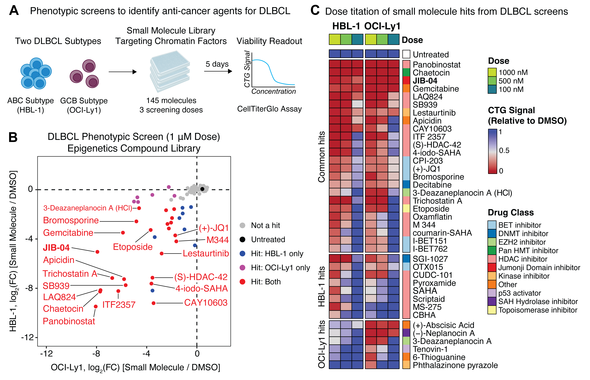

# Heterochromatin fidelity is a therapeutic vulnerability in lymphoma and other human cancers

**Citation:** Najia*, Jha*, et al. (2025). Heterochromatin fidelity is a therapeutic vulnerability in lymphoma and other human cancers. BioRxiv 

**BioRxiv Preprint Link:** https://www.biorxiv.org/content/10.1101/2025.01.31.635709v1.full   

